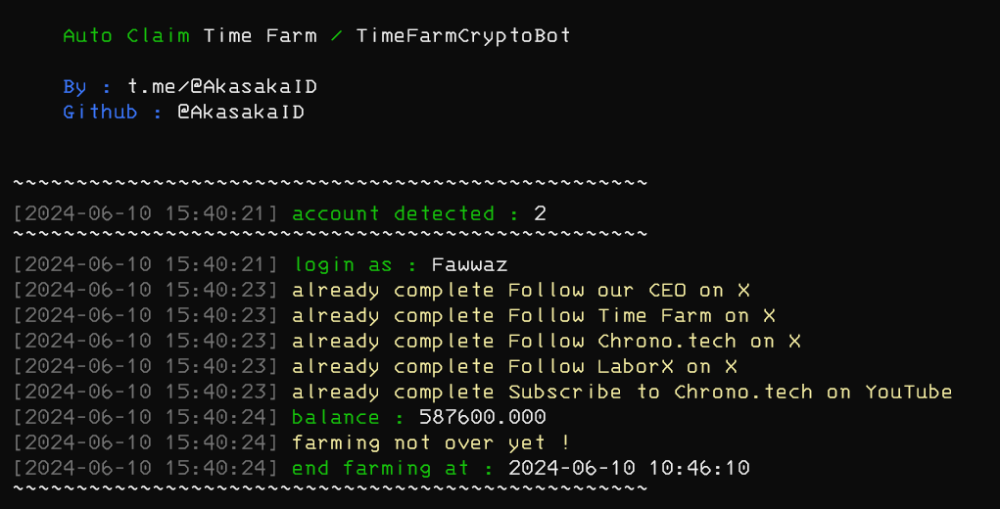

# TimeFarmTod

Auto claim for time farm telegram bot

<center>

</center>

# Table of Contens

- [TimeFarmTod](#timefarmtod)
- [Table of Contens](#table-of-contens)
- [Features](#features)
- [Warning !](#warning-)
- [Register](#register)
- [How to Use](#how-to-use)
  - [Config.json Explanation](#configjson-explanation)
  - [Get My Own API\_ID \& API\_HASH](#get-my-own-api_id--api_hash)
  - [Windows](#windows)
  - [Linux](#linux)
  - [Termux](#termux)
- [Discussion](#discussion)
- [Support](#support)
- [Thank you \< 3](#thank-you--3)

# Features

- [x] Auto Claim
- [x] Auto Claim Daily Reward
- [x] Support Multi Account
- [x] Auto Complete Task (except telegram task)
- [x] Using Random Device to [initConnection](https://core.telegram.org/method/initConnection)

# Warning !
According to [Telegram TOS](https://core.telegram.org/api/obtaining_api_id#using-the-api-id) all accounts that sign up or log in using unofficial Telegram API clients are automatically put under observation to avoid violations of the Terms of Service.

So be careful, hopefully your account won't get banned.

# Register 

Click the following link for register : https://t.me/TimeFarmCryptoBot?start=aL10AOUuixNmozwN

# How to Use

## Config.json Explanation

| key          | value             | description                                                                                                                   |
| ------------ | ----------------- | ----------------------------------------------------------------------------------------------------------------------------- |
| api_id       | string            | api_id for telegram client library, <br>see [Get My Own API\_ID \& API\_HASH](#get-my-own-api_id--api_hash) to get your own   |
| api_hash     | string            | api_hash for telegram client library, <br>see [Get My Own API\_ID \& API\_HASH](#get-my-own-api_id--api_hash) to get your own |
| auto_upgrade | bool (true/false) | auto upgrade account to next level                                                                                            |
| auto_task    | bool (true/false) | auto complete task (except telegram task)                                                                                     |
| interval     | integer (second)  | sleep time every account                                                                                                      |

## Get My Own API_ID & API_HASH

If you want to get your own api_id & api hash, you can goto <a href="https://my.telegram.org" target="_blank">https://my.telegram.org</a>

## Windows 

1. Make sure you computer was installed python and git.
   
   python site : [https://python.org](https://python.org)
   
   git site : [https://git-scm.com/](https://git-scm.com/)

2. Clone this repository
   ```shell
   git clone https://github.com/akasakaid/timefarmtod.git
   ```

3. goto timefarmtod directory
   ```
   cd timefarmtod
   ```

4. install the require library
   ```
   python -m pip install -r requirements.txt
   ```

5. fill the `data.txt` file with your data, how to get data you can refer to [How to Get Data](#how-to-get-data)
6. execute the main program 
   ```
   python bot.py
   ```

## Linux

1. Make sure you computer was installed python and git.
   
   python
   ```shell
   sudo apt install python3 python3-pip
   ```
   git
   ```shell
   sudo apt install git
   ```

2. Clone this repository
   
   ```shell
   git clone https://github.com/akasakaid/timefarmtod.git
   ```

3. goto timefarmtod directory

   ```shell
   cd timefarmtod
   ```

4. Install the require library
   
   ```
   python3 -m pip install -r requirements.txt
   ```

5. fill the `data.txt` file with your data, how to get data you can refer to [How to Get Data](#how-to-get-data)
6. execute the main program 
   ```
   python bot.py
   ```

## Termux

1. Make sure you termux was installed python and git.
   
   python
   ```
   pkg install python
   ```

   git
   ```
   pkg install git
   ```

2. Clone this repository
   ```shell
   git clone https://github.com/akasakaid/timefarmtod.git
   ```

3. goto timefarmtod directory
   ```
   cd timefarmtod
   ```

4. install the require library
   ```
   python -m pip install -r requirements.txt
   ```

5. fill the `data.txt` file with your data, how to get data you can refer to [How to Get Data](#how-to-get-data)
6. execute the main program 
   ```
   python bot.py
   ```

# Discussion

If you have an question or something you can ask in here : [@sdsproject_chat](https://t.me/sdsproject_chat)

# Support

To support me you can buy me a coffee via website in below

- Direct using QRIS [https://s.id/nusanqr](https://s.id/nusanqr)
- https://trakteer.id/fawwazthoerif/tip (ID)
- https://sociabuzz.com/fawwazthoerif/tribe (International)

# Thank you < 3